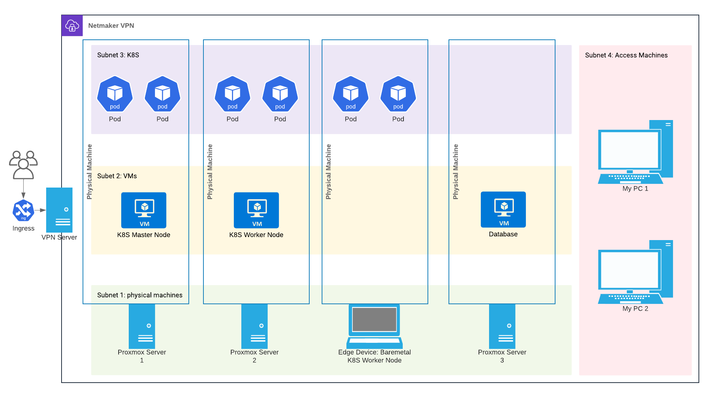

## Distributed K8S Cluster

There are a lot of challenges to making a distributed K8S cluster where nodes are located in multiple physical networks. These include:

* Allowing nodes to access eachother (VPN)
* Configuring the nodes as worker / master nodes
* Configuring a network plugin that works over the VPN
* Enabling LoadBalancers and Ingress 
* Exposing services to the Internet, and dealing with ingress / egress points to the cluster
* Managing machine outages without physical access

To solve these problems, this project creates a series of Terraform resources and Ansible playbooks which configure a distributed K8S cluster.

## How it works

### Requirements

To create the cluster, you need:

1. A dedicated machine on a cloud provider (AWS EC2, DigitalOcean Droplet) with a static ip at at least one vCPU and 1 GB of RAM.
2. At least one physical machine with Proxmox installed
3. Any number of physical edge devices
4. A control machine with Terraform and Ansible installed. Additionally, it needs SSH access to all the physical edge devices, API access to the Proxmox machines, and network access to the cloud machine.

The cloud machine hosts a [Netmaker VPN](https://www.netmaker.org/). This builds on top of wireguard to create virtual subnets, and provides explicit support for K8S network CNIs. The physical Proxmox machines will host VMs that will in turn become K8S nodes. This is the recomended way to run K8S nodes on sufficiently powerful hardware, because if the nodes networks break for whatever reason you can reboot it remotely without physical access. It also makes common operations such as backups and restoring much simpler. However, when K8S nodes are run baremetal, problems that break networking require physical access to fix. The physical edge devices will run K8S nodes baremetal. This is recomended for devices that have insufficient computational power to run VMs, such as Raspberry Pis. Finally, the control machine will be what provisions the entire cluster.

### Network Architecture

The diagram below shows the final network architecutre:

The cloud machine runs the Netmaker VPN and provides ingress. Physical machines are placed on their own subnet, VMs on another, K8S nodes on yet another, and finally access machines are on a fourth subnet. Each proxmox server can run multiple VMs.

Note that Netmaker is a mesh solution, which is not shown in the diagram. No DNS server is needed because Netmaker directly edits the `hosts` file of each machine.

Each physical machine and VM will run a lightweight SSH server (Dropbear) to provide remote access. 
